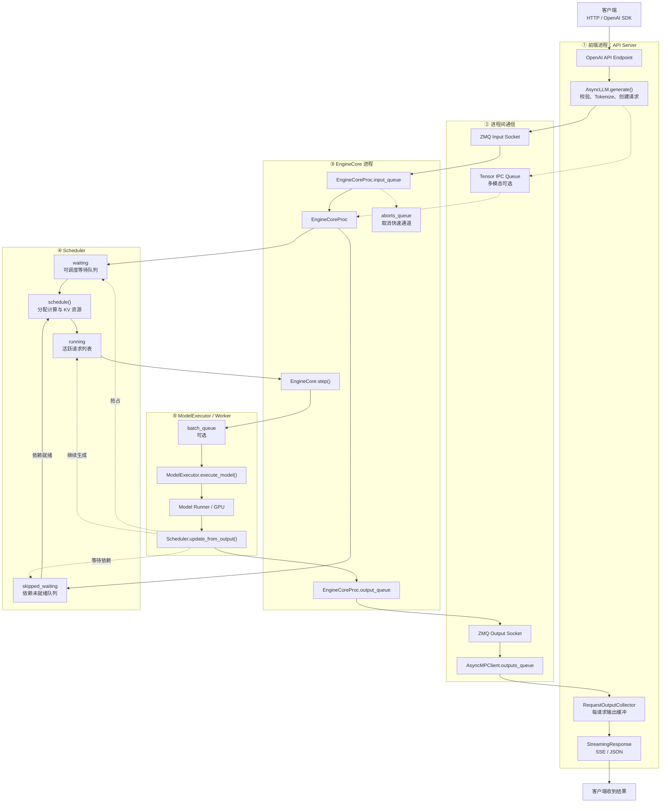
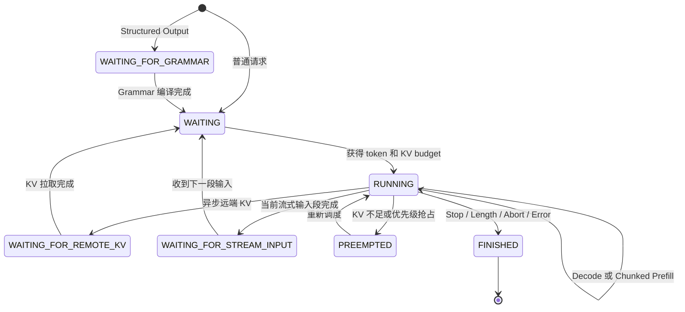
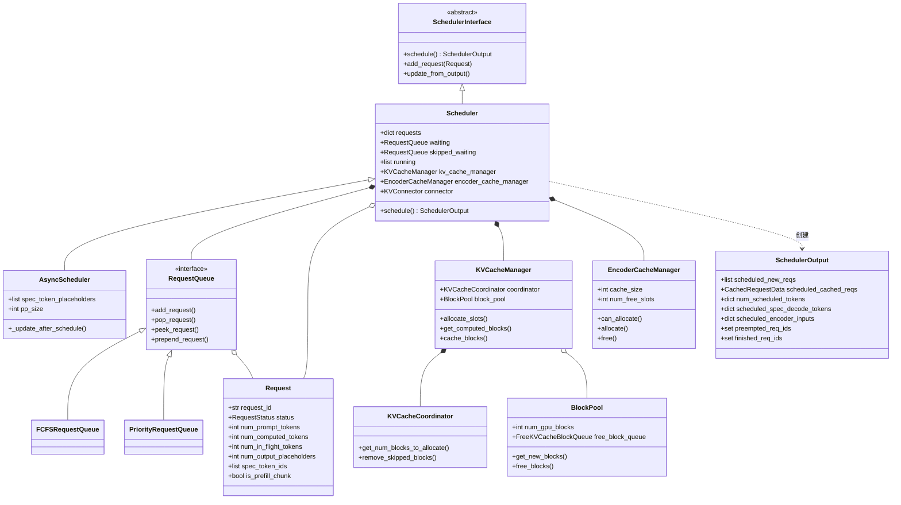

# vLLM V1：请求队列、Scheduler 与显存管理

> 源码仓库：<https://github.com/vllm-project/vllm>
>
> 分析基准：`main` 分支提交 `82daf9f5756e1868be0aa751afaec4726beca12a`
>
> 整理日期：2026-09-22

本文从一次请求的完整生命周期出发，梳理 vLLM V1 中的队列、Scheduler 组件、调度预算，以及 KV Cache 显存管理变量。

## 1. 请求主链路

vLLM V1 没有独立的 Prefill Queue 和 Decode Queue。Prefill、Chunked Prefill 与 Decode 请求都由统一 Scheduler 管理，通过 `num_computed_tokens`、本轮 token budget 和 KV Cache 状态决定每一步做什么。



主调用链可压缩为：

```text
AsyncLLM.generate()
    → AsyncMPClient._send_input()
    → EngineCoreProc.input_queue
    → Scheduler.add_request()
    → waiting / skipped_waiting
    → Scheduler.schedule()
    → running
    → ModelExecutor.execute_model()
    → Scheduler.update_from_output()
    → EngineCoreProc.output_queue
    → AsyncMPClient.outputs_queue
    → RequestOutputCollector
    → StreamingResponse
```

## 2. 主要队列和缓冲区

| 队列或容器 | 实现 | 作用 |
|---|---|---|
| `Scheduler.waiting` | FCFS `deque` 或优先级 heap | 等待获得计算与 KV 资源 |
| `Scheduler.skipped_waiting` | 同上 | 保存 Grammar、远端 KV、流式输入等依赖未就绪的请求 |
| `Scheduler.running` | `list[Request]` | 已经进入活跃集合的请求，并不保证每轮都执行 |
| `EngineCoreProc.input_queue` | `queue.Queue` | IO 线程到 EngineCore 主循环的请求入口 |
| `EngineCoreProc.output_queue` | `queue.Queue` | EngineCore 到输出 IO 线程的结果队列 |
| `AsyncMPClient.outputs_queue` | `asyncio.Queue` | ZMQ 输出接收任务到 AsyncLLM |
| `RequestOutputCollector` | 单槽位和 `asyncio.Event` | 每请求输出缓冲；DELTA 模式下可合并结果 |
| `batch_queue` | 有界 `deque` | 保存异步执行中的 batch futures，消除 pipeline bubble |
| `aborts_queue` | `queue.Queue` | 在模型执行返回后优先处理取消请求 |
| `async_output_queue` | `queue.Queue` | Worker 异步调度时的输出复制队列 |
| `streaming_queue` | 每请求 `deque` | EngineCore 侧的流式输入片段 |
| Tensor IPC Queue | `multiprocessing.Queue` | API 进程向 EngineCore 传递共享内存 Tensor |

`max_num_queued_reqs` 不是某个 Python Queue 的 `maxsize`，而是 API 层 admission control，限制 waiting 与 running 的总在途请求数。

## 3. Scheduler 请求状态



`waiting` 中主要是 `WAITING` 和 `PREEMPTED`；`skipped_waiting` 中主要是：

- `WAITING_FOR_STRUCTURED_OUTPUT_GRAMMAR`
- `WAITING_FOR_REMOTE_KVS`
- `WAITING_FOR_STREAMING_REQ`

## 4. Scheduler 类关系



## 5. 一次 `schedule()` 的阶段

1. 初始化本轮临时集合与预算，并调用 `kv_cache_manager.new_step_starts()`。
2. 先遍历 `running`，计算每个请求的 `num_new_tokens`。
3. 检查 Encoder 预算、输入槽位和最大模型长度。
4. 调用 `KVCacheManager.allocate_slots()` 分配本轮需要的 KV block。
5. KV 空间不足时，抢占低优先级或队尾的 running 请求并重试。
6. 再遍历 `waiting` 与 `skipped_waiting`。
7. 查询本地 Prefix Cache 和可选的远端 KV Cache。
8. 检查新请求是否能完整或分块进入 running。
9. 构建 `NewRequestData`、`CachedRequestData` 与 `SchedulerOutput`。
10. 附加 KV/Encoder Connector metadata，并乐观更新请求的计算进度。

`schedule()` 不执行模型。它的输出边界是：

```text
Scheduler.schedule()
    → SchedulerOutput
    → ModelExecutor.execute_model()
    → ModelRunnerOutput
    → Scheduler.update_from_output()
```

## 6. 三套调度预算

### `token_budget`

```python
token_budget = max_num_scheduled_tokens
token_budget -= num_new_tokens
```

表示本轮目标模型允许计算多少逻辑 token：

```text
Σ num_scheduled_tokens[request] <= max_num_scheduled_tokens
```

它是计算与调度限制，不是显存字节数。

### `input_budget`

```python
input_budget = max_num_batched_tokens
input_budget -= num_new_tokens + draft_slots
```

表示 Model Runner 本轮输入张量还能容纳多少输入位置：

```text
Σ (num_new_tokens[r] + draft_slots) <= max_num_batched_tokens
```

它影响输入张量、attention workspace、激活峰值、LoRA 静态 buffer 和 CUDA Graph shape，因此会间接影响显存，但不直接表示 KV Cache 剩余空间。

### `draft_slots`

表示 speculative decoding 时，每个被调度请求额外占用的 Model Runner 输入/query 槽位。

| 方法 | `draft_slots` |
|---|---:|
| EAGLE3，非并行 drafting | `0` |
| P-EAGLE | `K - 1` |
| DFlash | `K` |
| DSpark | `K - 1` |
| MTP / N-gram | `0` |
| 普通 Draft Model | `1` |
| PARD | `K` |

其中 `K = num_speculative_tokens`。

## 7. `draft_slots` 与 `num_lookahead_tokens`

| 变量 | 管理对象 | 是否直接参与 KV 分配 |
|---|---|---|
| `draft_slots` | Model Runner 输入槽位 | 否 |
| `num_lookahead_tokens` | Drafter 需要预留的未来 KV 位置 | 是 |
| `num_spec_tokens` | 一次最多推测的 token 数 | 间接影响两者 |

例如普通 EAGLE3 可以出现：

```text
draft_slots = 0
num_lookahead_tokens = K
```

输入张量不需要额外 drafting slot，但 KV Cache 仍需为未来 K 个位置预留空间。

## 8. Request 中的 token 进度变量

```text
num_tokens
    = prompt tokens + 已确认的 output tokens

num_tokens_with_spec
    = num_tokens + len(spec_token_ids)

num_new_tokens
    = num_tokens_with_spec
      + num_output_placeholders
      - num_computed_tokens
```

关键成员：

| 成员 | 含义 |
|---|---|
| `num_prompt_tokens` | Prompt 长度 |
| `num_tokens` | Prompt 与已确认输出的总长度 |
| `spec_token_ids` | 尚未由目标模型验证的 draft tokens |
| `num_computed_tokens` | Scheduler 乐观认为已经计算的位置数 |
| `num_in_flight_tokens` | 已调度但 GPU 输出尚未结算的 token 数 |
| `num_output_placeholders` | 异步调度中已预占但实际 token 尚未返回的位置 |
| `num_preemptions` | 请求被抢占次数 |

Scheduler 发出任务后会乐观执行：

```python
request.num_computed_tokens += num_scheduled_tokens
request.num_in_flight_tokens += num_scheduled_tokens
```

因此真正已经完成、可以安全据此释放旧 KV 的进度近似为：

```text
num_computed_tokens - num_in_flight_tokens
```

## 9. KV Cache 显存管理

### 启动时

```text
GPU 总显存
    × gpu_memory_utilization
    = requested_memory

requested_memory
    - 模型权重
    - 非 KV 内存
    - 激活峰值
    - CUDA Graph 显存
    = available_kv_cache_memory_bytes

available_kv_cache_memory_bytes
    ÷ KV page/block 字节数
    = KVCacheConfig.num_blocks
```

重要配置：

| 变量 | 含义 |
|---|---|
| `gpu_memory_utilization` | 当前 vLLM 实例允许使用的显存比例 |
| `kv_cache_memory_bytes` | 手动指定每张 GPU 的 KV Cache 字节数，设置后覆盖自动推断 |
| `available_kv_cache_memory_bytes` | Profiling 后可用于 KV Cache 的显存 |
| `num_gpu_blocks` | 最终 KV block 总数 |
| `block_size` | 一个 attention KV block 容纳的 token 数 |

### 运行时

`KVCacheManager.allocate_slots()` 综合考虑：

```text
已计算 token
+ 本地 Prefix Cache hit
+ 远端 KV hit
+ 本轮 num_new_tokens
+ num_lookahead_tokens
```

然后判断：

```text
available_blocks = free_blocks - reserved_blocks

required_blocks = num_blocks_to_allocate + watermark_blocks

required_blocks <= available_blocks
```

返回值：

- 返回 `KVCacheBlocks`：分配成功；
- 返回 `None`：空间不足，Scheduler 尝试抢占；
- 抢占后仍失败：本轮停止继续调度。

### 保护变量

| 变量 | 含义 |
|---|---|
| `free_blocks` | 当前可分配或可驱逐的 KV block 数 |
| `watermark_blocks` | 接纳 waiting/preempted 请求时必须留下的空闲余量 |
| `reserved_blocks` | 为其他在途 Prefill 或 Spec Decode 保留的 block |
| `full_sequence_must_fit` | 是否要求新请求整个输入序列都能容纳 |
| `num_lookahead_tokens` | Speculative drafter 额外需要的 KV 位置 |
| `num_encoder_tokens` | Encoder-Decoder cross-attention 所需的 KV 位置 |
| `num_in_flight_tokens` | GPU 尚未结算，因此暂不能释放对应 block 的 token 数 |
| `kv_cache_manager.usage` | `1 - free_blocks / total_blocks` |

## 10. 最终调度条件

一个请求要在本轮成功进入模型执行，需要同时满足：

```text
有 token_budget
且有 input_budget
且未超过 max_num_active_seqs
且 KVCacheManager 能分配所需 blocks
且 Encoder Cache / LoRA / 多模态约束满足
且 Grammar、远端 KV、流式输入等依赖已经 ready
```

任一条件不满足，请求会继续等待、进入 `skipped_waiting`，或触发 running 请求抢占。

## 11. 推荐源码阅读顺序

1. `vllm/v1/core/sched/request_queue.py`：FCFS 与 Priority Queue。
2. `vllm/v1/request.py`：请求状态和 token 进度成员。
3. `vllm/v1/core/sched/scheduler.py`：`Scheduler.__init__()` 与 `schedule()`。
4. `vllm/v1/core/kv_cache_manager.py`：`allocate_slots()`。
5. `vllm/v1/core/block_pool.py`：物理 block 分配、释放和 Prefix Cache 驱逐。
6. `vllm/v1/core/encoder_cache_manager.py`：多模态 Encoder Cache。
7. `vllm/v1/core/sched/output.py`：`SchedulerOutput` 数据边界。
8. `vllm/v1/engine/core.py`：Scheduler 与 ModelExecutor 的衔接。
9. `vllm/v1/engine/core_client.py`：前端与 EngineCore 的 IPC。
10. `vllm/v1/engine/async_llm.py`：请求进入与流式结果返回。
